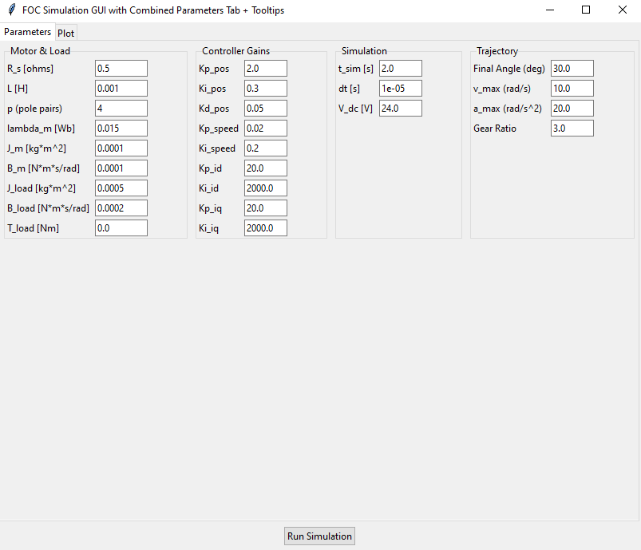
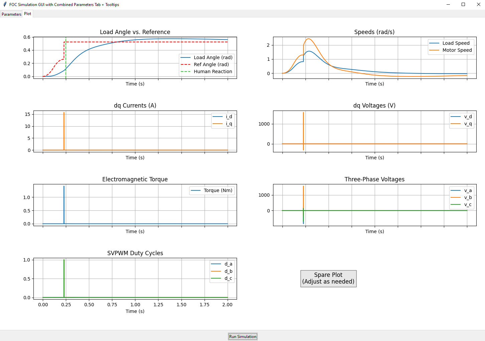

# FOC Simulation with GUI

This repository contains a **Python-based Field-Oriented Control (FOC) simulation** for a Brushless DC (BLDC)/PMSM motor, along with a **Tkinter GUI** that allows you to edit parameters and plot the simulation results.

<p float="left">
  
  
</p>

<p align="center">
  <strong>Diagram A</strong> &nbsp;&nbsp;&nbsp;&nbsp;&nbsp;&nbsp;
  <strong>Diagram B</strong>
</p>

## How to Run
1. Clone or download this repository.
2. In a terminal (or cmd prompt) navigate to the project folder
3. Run: python gui.py

## Using the GUI

1. Parameters Tab:
    - You’ll see four columns:
        1. Motor & Load: Resistance, inductance, pole pairs, flux, inertia, friction, etc.
        2. Controller Gains: Position loop (Kp, Ki, Kd), speed loop, and dq current loops.
        3. Simulation: Total simulation time, time-step, DC bus voltage.
        4. Trajectory: Final angle (deg), max velocity, max acceleration, gear ratio.
    - Hover over any label to see a tooltip with more details about that parameter.
2. Run Simulation Button:
    - After editing parameters, click “Run Simulation”.
    - The script collects all parameter values, calls the FOC simulation function, and then plots the results in the Plot tab.
3. Plot Tab:
    - Displays eight subplots (arranged in 4×2) showing:
        - Load angle vs. reference
        - Speeds
        - dq currents
        - dq voltages
        - Electromagnetic torque
        - Three-phase voltages
        - PWM duty cycles
        - One spare plot (placeholder)
    - You can switch back and forth between tabs.

## Simulation Details
- Trapezoidal Velocity Profile: The motor’s position reference is generated by a trapezoid (or triangular if the distance is too short) motion profile up to the final angle (in degrees).
- FOC Loops:
    1. Position Loop (outer) → speed reference
    2. Speed Loop (middle) → torque/current reference
    3. Current Loops (inner, dq-axis) → voltage commands
- Space-Vector PWM: The dq voltage commands are transformed back into three-phase voltages and duty cycles.
- Electrical & Mechanical Equations: The motor’s stator equations are integrated each time-step, as well as the rotor/load inertia and friction.

## Customization
- Motor/Load Parameters: Adjust default values in foc_sim.py to match your hardware.
- Controller Gains: Tune Kp/Ki/Kd for position/speed/current loops to see different control responses.
- Plot Layout: Modify the draw_plots_in_figure method in gui.py to add or remove subplots.
- Tooltips: You can adjust tooltip text or position in the create_tooltip function.

## Contents

1. **`foc_sim.py`**  
   - Holds all the **motor/load parameters**, **controller gains**, and the **simulation logic** (including a trapezoidal velocity profile, the electrical/mechanical equations, and space-vector PWM calculations).  
   - Returns a dictionary of time-series results (currents, voltages, torques, etc.) after running the simulation.

2. **`gui.py`**  
   - Provides a **Tkinter** interface with two tabs:
     1. **Parameters**: All motor, load, controller, simulation, and trajectory parameters in **one** tab, arranged in columns. You can edit them directly in text fields.
     2. **Plot**: Shows **embedded Matplotlib** subplots after the simulation run.  
   - Includes **tooltips** on each parameter label, displaying short explanations when you hover the mouse over them.

## Requirements

- **Python 3.7+** (or newer)
- **NumPy** (for numeric arrays)
- **Matplotlib** (for plotting)
- **Tkinter** (typically comes with Python on most platforms)
- (Optional) **venv** or **conda** environment recommended for clean dependency management.

You can install dependencies via:
```bash
pip install numpy matplotlib

